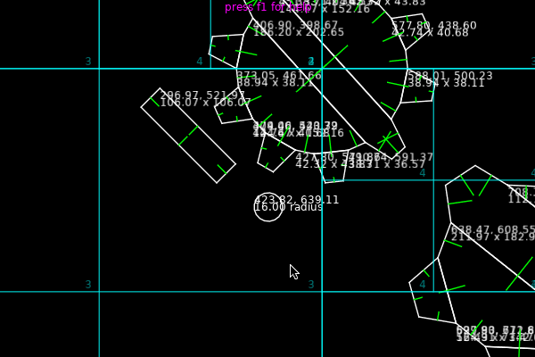
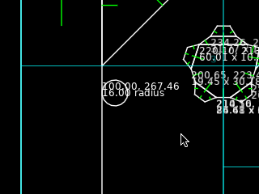
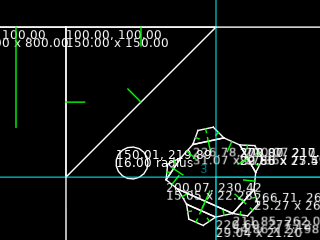
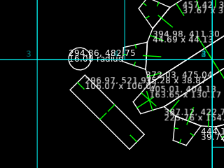
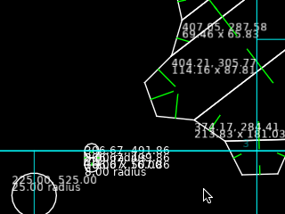

# slick

**slick** is a simple two-dimensional swept collision library with support for polygons inspired by the simplicity and robustness of [bump.lua](https://github.com/kikito/bump.lua).



* Supports polygon-polygon, circle-polygon, and circle-circle collisions.
* All shapes are swept, meaning tunneling isn't possible.
* Allows combining multiple shapes for one entity.
* Simple "polygon mesh" shape that takes pretty much any contour data (including degenerate contour data) and produces a valid series of polygon shapes.
* "Game-istic" collision handling and response instead of realistic, physics-based collision handling and response.
* Rectangle, line segment, ray, circle, and point queries against the world.
* Triangulation and polygon clipping support.
* Advanced navigation mesh support with string pulling.

There are no dependencies (other than the demo and debug drawing code using LÖVE). It can be used from any Lua 5.1-compatible environment. There are certain optimizations available when using LuaJIT, but fallbacks are used in vanilla Lua environments.

**slick** is good for platformers, top-down, and any other sort of game where you need rotated objects and circles/polygons for collision. If you're making a Mario game or Zelda game where everything is an axis-aligned rectangle, then `bump.lua` is probably better.

**slick** is **not** good for games that need realistic physics responses. The library has no concepts of physical properties like acceleration, mass, or angular velocity. If you need more realistic physics, then try Box2D or something.

Suggestions, bug reports, and improvements are welcome. Make sure there's not already an open issue with your bug or suggestion; feel free to jump in and continue the discussion or offer your perspective in an existing issue.

## Example

```lua
local slick = require("slick")

local w, h = 800, 600
local world = slick.newWorld(w, h)

local player = { type = "player" }
local level = { type = "level" }

world:add(player, w / 2, h / 2, slick.newRectangleShape(0, 0, 32, 32))
world:add(level, 0, 0, slick.newShapeGroup(
    -- Boxes surrounding the map
    slick.newRectangleShape(0, 0, w, 8), -- top
    slick.newRectangleShape(0, 0, 8, h), -- left
    slick.newRectangleShape(w - 8, 0, 8, h), -- right
    slick.newRectangleShape(0, h - 8, w, 8), -- bottom
    -- Triangles in corners
    slick.newPolygonShape({ 8, h - h / 8, w / 4, h - 8, 8, h - 8 }),
    slick.newPolygonShape({ w - w / 4, h, w - 8, h / 2, w - 8, h }),
    -- Convex shape
    slick.newPolygonMeshShape({ w / 2 + w / 4, h / 4, w / 2 + w / 4 + w / 8, h / 4 + h / 8, w / 2 + w / 4, h / 4 + h / 4, w / 2 + w / 4 + w / 16, h / 4 + h / 8 })
))

local goalX, goalY = w / 2, -1000
local actualX, actualY, cols, len = world:move(player, goalX, goalY)

-- Prints "Attempted to move to 300, -1000 but ended up at 300, 8 with 1 collision(s).
if len > 0 then
    print(string.format("Attempted to move to %d, %d but ended up at %d, %d with %d collision(s)", goalX, goalY, actualX, actualY, len))
else
    print(string.format("Moved to %d, %d.", actualX, actualY))
end

-- Prints "Collision with level."
for i = 1, len do
    print("Collision with %s.", cols[i].other.type)
end

world:remove(player)
world:remove(level)
```

## Table of Contents

1. [Introduction](#introduction)
   1. [Installation](#installation)
   1. [Adding & removing items](#adding--removing-items)
2. [Documentation](#documentation)
   1. [slick.world](#slickworld)
       * [slick.world.newWorld](#slickworldnewworld): Create new world
       * [slick.world.add](#slickworldadd): Add new item to world
       * [slick.world.has](#slickworldhas): Check if an item exists in the world
       * [slick.world.get](#slickworldget): Get an entity represented by an item in the world
       * [slick.world.update](#slickworldupdate): Update transform and shape of an item in the world
       * [slick.world.move](#slickworldmove): Move an item in the world performing collision response
       * [slick.world.check](#slickworldcheck): Simulate moving an item in the world performing collision response
       * [slick.world.project](#slickworldproject): Project an item in the world from one position to another position without collision response
       * [slick.world.test](#slickworldproject): Tests an item in the world at the specified position without collision response
       * [slick.world.push](#slickworldpush): Attempt to push a potentially penetrating item in the world
       * [slick.world.rotate](#slickworldrotate): Attempt to rotate an item in the world and then push potentially penetrating items out
       * [slick.world.queryPoint](#slickworldquerypoint): Query all items under the point in the world
       * [slick.world.queryRay](#slickworldqueryray): Query all items colliding the ray in the world
       * [slick.world.querySegment](#slickworldquerysegment): Query all items colliding the segment in the world
       * [slick.world.queryRectangle](#slickworldqueryrectangle): Query all items colliding the rectangle in the world
       * [slick.world.optimize](#slickworldoptimize): Optimize quad tree representing world
       * [slick.worldFilterQueryFunc](#slickworldfilterqueryfunc): Interface to filter world during collision response
       * [slick.worldShapeFilterQueryFunc](#slickworldshapefilterqueryfunc): Interface to filter world during queries
       * [slick.worldVisitFunc](#slickworldvisitfunc): Interface for visiting items during collision response
       * [slick.worldQuery](#slickworldquery): Re-usable world query instance
       * [slick.worldResponseFunc](#slickworldresponsefunc): Stateless function interface for handling responses
   2. [slick.entity](#slickentity)
   3. [slick.collision.shapelike and shape definitions](#slickcollisionshapelike-and-shape-definitions)
   4. [slick.geometry.transform](#slickgeometrytransform)
   5. [Simple triangulation, polygonization, and clipping API](#simple-triangulation-polygonization-and-clipping-api)
   6. [Advance usage](#advanced-usage)
      1. [slick.geometry.triangulation.delaunay](#slickgeometrytriangulationdelaunay)
      2. [slick.geometry.clipper](#slickgeometryclipper)
      4. [slick.navigation](#slicknavigation)
        * [slick.navigation.meshBuilder](#slicknavigationmeshbuilder)
        * [slick.navigation.mesh](#slicknavigationmesh)
        * [slick.navigation.path](#slicknavigationpath)
        * [slick.navigation geometry](#slicknavigation-geometry)
      3. [slick.util.search](#slickutilsearch)
3. [License](#license)

## Introduction

### Installation

Copy the **`slick`** directory from the root of the release ZIP or the root of the **slick** Git repository and add it somewhere in your project!

For example, to add the latest version of slick to an existing folder `libs/` in your project from the terminal / command line, do this:

```sh
git clone 'https://github.com/erinmaus/slick.git' slick-latest && cp -r ./slick-latest/slick ./libs/slick
```

Or on Windows (with PowerShell or the Command Prompt):

```powershell
git clone "https://github.com/erinmaus/slick.git" "slick-latest" && xcopy /e /k /h /i ".\slick-latest\slick" ".\libs\slick" && rd /s /q "slick-latest"
```

This command will:

1. Clone **slick** into a folder in your current directory named `slick-latest` with the contents of the **slick** repo.
2. Copy the **slick** library from `./slick-latest/slick` to `./libs/slick` in your project.
3. Delete the `slick-latest` folder.

**This is just an example.** It's assumed that you can modify the command to fit your needs if you'd rather use a terminal / command line over manually downloading **slick** from the releases page.

### Adding & removing items
First, require **slick**:

```lua
local slick = require("slick") -- or wherever you put it; e.g., if you put it in `./libs/slick` then use `require("libs.slick")`
```

**Import warning**

**Do not import into individual files in slick!** Some import magic goes on. If you do something like:

```lua
local tag = require("libs.slick.tag")
```

...this will **not** be the same object (to **slick**) as returned by `"slick.newTag"`. Anything not exposed directly by importing **slick** is considered private. Please only use the constructors in the object returned by **slick**'s root import.

With that said...

Next, create a new world:

```lua
-- width & height are suggestions but try and be as close as possible to the world size
-- slick uses a quad tree, and the better fitting the quad tree the faster collisions will be.
-- by default, the top left of the world is (0, 0) but this can be changed (see documentation for `slick.newWorld`)
-- The quad tree dimensions will expand if an entity goes outside the world by default, but it might create a one-sided quad tree.
local world = slick.newWorld(width, height)
```

Then, add an item to the world:

```lua
world:add(item, x, y, shape)

-- OR
world:add(item, transform, shape)
```

* `item` can be any value but ideally is a table representing the entity
* `x` and `y` are the location of `item` in the world, **or** `transform` is a `slick.geometry.transform` object with position, rotation, scale, and offset components
* `shape` is a `slick.collision.shapelike` object created by functions like `slick.newPolygonShape`, `slick.newRectangleShape`, `slick.newCircleShape`, etc; see `slick.collision.shapelike` documentation below

If `item` already exists in the world, you will receive an error. You can use `slick.world.has` to check if the world already contains `item`.

`slick.world.add` returns a `slick.entity` for advanced usage. Please see `slick.entity` documentation for more. **Entity** will refer to an `item` that is located in the world.

To remove an item from the world at some point:

```lua
world:remove(item)
```

To update the position and shape of an entity:

```lua
-- `shape` is optional in both overloads

world:update(item, x, y, shape)

-- OR
world:update(item, transform, shape)
```

Be warned: this will instantly teleport an entity to the position or change its shape without any collision checks.

To move an entity:

```lua
local actualX, actualY, collisions, count = world:move(item, goalX, goalY, function(item, other, shape, otherShape)
    return "slide"
end)
```

This method will attempt to move the entity from its current position to `(goalX, goalY)`. It will perform a swept collision and iteratively resolve collisions until there are no more collisions or a max "bounce" count has been reached (see documentation for `slick.newWorld`). The `(actualX, actualY)` return values are the position of the entity in the world after the movement attempt.

The (optional) filter function can change the behavior of the built-in collision responses. You can return a collision response handler based on `item`, `other`, or even the collision shapes `shape` and `otherShape`. By default, collisions are treated as `"slide"` if no filter function is provided.

There are currently three built-in collision responses:

* `"slide"`: "slides" along other entities

  
* `"touch"`: stops moving as soon as a collision between entities occurs

  
* `"cross"`: goes through another entity as if it the moving entity is a ghost; entities "ghosted" through still be in the `slick.worldQueryResponse`, though they will not contribute to collision resolution.

  

* `"bounce"`: "bounces" against the entity; this adds a (`extra.bounceNormal.x`, `extra.bounceNormal.y`) representing the reflection vector to the `slick.worldQueryResponse` (see below). The bounce normal can be used to change the direction the entity is moving in.

  

`collisions` is a list of `slick.worldQueryResponse` of all the collisions that were handled during the movement and `count` is equal to `#collisions`. Some fields of note are:

* `item`, `entity`, `shape`: The item, entity, and shape of the moving entity.
* `other`, `otherEntity`, `otherShape`: The item, entity, and shape of the entity we collided with.
* `response`: The name of the collision response handler that resolved this collision.
* `normal.x, normal.y`: The surface normal of the collision. This normal comes from an edge of `otherShape`.
* `alternateNormal.x, alternateNormal.y`: The other surface normal of the collision. This normal comes from an edge of `shape`.
* `depth`: The penetration depth. Usually this is 0 since collisions are swept, but other methods that return `slick.worldQueryResponse` for overlapping objects might have a `depth` value greater than zero.
* `offset.x, offset.y`: The offset from the current position to the new position.
* `touch.x, touch.y`: This is the sum of the current position before impact and `offset.x, offset.y`
* `contactPoint.x, contactPoint.y`: The contact point closest to the center of the entity. For all contact points, use the `contactPoints` array.

See `slick.worldQueryResponse` documentation for more information.

**Note:** unlike `bump.lua`, since an entity can be composed of multiple shapes, there might be multiple pairs of (`item`, `other`) during a movement where the `shape`/`otherShape` is different. Similarly, since **slick** iteratively resolves collisions, the same (`item`, `other` `shape`, `otherShape`) tuple might occur more than once in `collisions`.

For an example player movement method, try this:

```lua
local function movePlayer(player, dt)
  local goalX, goalY = player.x + dt * player.velocityX, player.y + dt * player.velocityY
  player.x, player.y = world:move(player, goalX, goalY)
end
```

For more advanced documentation about these methods, see below.

## Documentation

Below is an API reference for **slick**.

### `slick.world`

<a id="slickworldnewworld"></a>

* `slick.newWorld(width: number, height: number, options: slick.options?): slick.world`

  Creates a new `slick.world`. `width` and `height` are the width and height of the world. By default, the upper left corner of the world is (0, 0) and the bottom right corner is (`width`, `height`).

  `options` is an optional table with the following fields:
    * `maxBounces`: The max number of bounces to perform during a movement. The higher, the more accurate crowded areas might be. The default should be good games using pixels as units.
    * `quadTreeX`, `quadTreeY`: The upper-left corner of the quad tree. Defaults to (0, 0).
    * `quadTreeMaxLevels`: The maximum depth of the quad tree. Note: this value will automatically go up if the quad tree expands.
    * `quadTreeMaxData`: The maximum amount of leaf nodes.
    * `quadTreeExpand`: Expand the quad tree as objects exceed the current boundaries. This defaults to true. If false and an object is outside the quad tree, an error will be raised. You can also call `slick.world.optimize` at any point to rebuild the quad tree and recalculate the dimensions.
    * `quadTreeOptimizationMargin`: Additional margin (as a percent of `width` and `height`) to use around the world when using `slick.world.optimize`.
    * `epsilon`: the "precision" of certain calculations. The default precision is good for games with pixels as units. This defaults to `slick.util.math.EPSILON` (check the code first, but as of writing it is `1e4`). If you use larger units, e.g. meters or even centimeters, you might want to make this value **smaller**. If you're using even smaller units than pixels, the simulation might become unreliable, but you can try (and also make this value **bigger**... maybe). You will know the value is good or bad if objects overlap, penetrate, and/or stay apart or get stuck during collisions (bad) or "just touch" without overlap, intersection, or penetration (good).

    **These are so super advanced features documented here only for posterity or development purposes:**

    * `sharedCache`: This is an optional `slick.cache` to use for this world. This is a very advanced feature and is only useful if you have multiple `slick.world` objects and need to share things like the triangulator between them. To create a cache, use `slick.newCache` and pass in an `slick.options` object. You can then pass around the cache to different worlds via the `sharedCache` field in `slick.options`. **This is probably only needed in 1% of use cases where you would create multiple worlds! Don't prematurely optimize!**
    * `debug`: slows down certain things dramatically but ensures robustness of simulation with lots of error checking and `assert(...)`s. This is `false` by default. **Only should be enabled if trying to submit a detailed bug report or doing development on slick. Do not expect even remotely realtime performance with this enabled.**

  There is no one-size-fits-all for the quad tree options. You will have to tweak the values on a per-game, and perhaps even per-level, basis, for maximum performance. In an open-world game, for example, you might have to adjust these values over time. See `slick.world.optimize` for specifics.

<a id="slickworldadd"></a>

* `slick.world:add(item, x: number, y: number, shape: slick.collision.shapelike): slick.entity` **or** `slick.world:add(item, transform: slick.geometry.transform, shape: slick.collision.shapelike): slick.entity`

  Adds a new entity to the world with `item` as the handle at the provided location (either (`x`, `y`) or `transform`). If `item` already exists, this method will raise an error. For valid shapes, see `slick.collision.shapelike` below. For `transform` properties, see `slick.geometry.transform` below.

<a id="slickworldhas"></a>

* `slick.world:has(item): boolean`

  Returns true if `item` exists in the world; false otherwise. Remember: it is an error to `remove` an item that is **not** in the world and it is an error to `add` an item that already exists in the world.

<a id="slickworldget"></a>

* `slick.world:get(item): slick.entity`

  Gets the `slick.entity` represented by `item`. Will return `nil` if no entity is represented by `item` (i.e., `item` **was not** added to the world). See `slick.entity` for usage and properties.

<a id="slickworldupdate"></a>

* `slick.world:update(item, x: number, y: number, shape: slick.collision.shapelike?): number, number` **or** `slick.world:update(item, transform: slick.geometry.transform, shape: slick.collision.shapelike?): number, number`

  Instantly moves the entity represented by `item` to the provided location or transforms the entity by the provided transform. Optionally you can change the shape of the entity by passing in a `slick.collision.shapelike`. The shape does not change if no `shape` is provided.


<a id="slickworldmove"></a>

* `slick.world:move(item, goalX: number, goalY: number, filter: slick.worldFilterQueryFunc?, query: slick.worldQuery?): number, number, slick.worldQueryResponse[], number, slick.worldQuery`

  Attempts to move the entity represented by `item` to the provided location. If there is anything blocking movement at some point, then the returned (`actualX`, `actualY`) will be different from the goal. Returns the actual location; an array of collision responses; the length of said collision response array; and the `slick.worldQuery` used during the movement.

  **For advanced usage**, by passing in a `slick.worldQuery`, you can save on garbage creation. You can create a `slick.worldQuery` using `slick.newWorldQuery(world)` and re-use it between calls that accept a `query`. Keep in mind **any** collision responses or other query properties from the previous usage of the query **will** be invalidated. This includes point fields like `touch`.

  `slick.world.move` is essentially a wrapper around `slick.world.check` and `slick.world.update`. First, the method attempts a movement, and then moves to the last safe position given the goal.


<a id="slickworldcheck"></a>

* `slick.world:check(item, goalX: number, goalY: number, filter: slick.worldFilterQueryFunc?, query: slick.worldQuery?): number, number, slick.worldQueryResponse[], number, slick.worldQuery`

  Performs a collision movement check, but does not update the location of the entity represented by `item` in the world. This method is otherwise identical to `slick.world.move`.

  For advanced usage with the `query` parameter, see `slick.world.move` above.

<a id="slickworldproject"></a>

* `slick.world:project(item, x: number, y: number, goalX: number, goalY: number, filter: slick.worldFilterQueryFunc?, query: slick.worldQuery?): slick.worldQueryResponse[], number, slick.worldQuery`

  Projects `item` as if it is currently at (`x`, `y`) and is moving towards (`goalX`, `goalY`). Returns all potential collisions, sorted by time of collision.

  For advanced usage with the `query` parameter, see `slick.world.move` above.

  This can be used to build custom collision response handlers and other advanced functionality.

<a id="slickworldtest"></a>

* `slick.world:test(item, x: number, y: number, filter: slick.worldFilterQueryFunc?, query: slick.worldQuery?): slick.worldQueryResponse[], number, slick.worldQuery`

  Tests all collisions as if `item` were at (`x`, `y`) and **is not moving.** Returns all **current collisions** in no particular order since `time` will always be 0.

  For advanced usage with the `query` parameter, see `slick.world.move` above.

  This can be used to build custom "move then collide" response handlers and other advanced functionality while still utilizing **slick**'s broadphase and polygon collision features. For example, instead of `move` you could do something like this:

  ```lua
  local collisions = world:test(item, goalX, goalY)
  for _, collision in ipairs(collisions) do
    world:update(item, goalX + collision.normal.x * collision.depth, goalY + collision.normal.y * collision.depth)
  end
  ```

  This will effectively **move** an object to (`goalX`, `goalY`) and then **push** it out of any collisions. You'd obviously want something a little more robust than this... But that's the idea!

  Only use **small movement values** or you might just skip over objects between your current position and next position! `slick.world.project` is better if you want to handle all collisions between the current position and next position.

  Also... This method isn't special! `slick.world:test` is just a shortcut for `slick.world:project(item, x, y, x, y, filter, query)`.

<a id="slickworldpush"></a>

* `slick.world:push(item, filter: slick.worldFilterQueryFunc, x: number, y: number, shape: slick.collision.shapelike?): number, number` **or** `slick.world:push(item, filter: slick.worldFilterQueryFunc, transform: slick.geometry.transform, shape: slick.collision.shapelike?): number, number`

  Update an entity and attempts to push it out of any objects it might colliding with.
  
  Like `slick.world.update`, takes an `x, y` tuple or `transform` and optionally a `slick.collision.shapelike`. Moves the entity to the position and updates the shape (if a shape is provided). This does not perform any collision detection at this point.

  After moving the entity to the desired position (and updating the shape, if provided), attempts to "push" the entity represented by `item` out of any other entities filtered by `filter`. This can be used, for example, when placing items in the world. Normally, if an entity is **not** overlapping another entity currently, it will **never** overlap another entity. But if you're placing an item due to a mouse click, you might want to use this (or use a query and prevent placing an entity if it doesn't fit!).

  The entity will **never** overlap another entity filtered by `filter` **but** it might go somewhere you wouldn't expect! If you place an entity inside a wall, it will try and take the shortest route out, but this is not guaranteed based on the location of the object and the other entities.

  **Pushing an object near a line segment can cause it to "pass-through" the line segment.**

<a id="slickworldrotate"></a>

* `slick.world:rotate(item, angle: number, rotateFilter: slick.worldFilterQueryFunc, pushFilter: slick.worldFilterQueryFunc, query: slick.worldQuery?)`

  This method will instantly rotate an object to `angle` (in radians) and then attempt to push all filtered entites **out** of the way. **There is no swept collisions for rotations!** So if rotations are massive, call this method multiple times in increments of the rotation.

  `rotateFilter` is used to filter all entities that will be pushed (via `slick.world.push`) out of the way of the rotating `item`. `pushFilter` is used to determine what entities, when pushing via `slick.world.push`, will affect the push. You might want all items of type `thing` to be affected by the rotation of `item`; but then only have the `thing` items by pushed by level geometry (and, probably, the rotating `item`).

  See the `moveGear` function in the demo for an example usage of this.

  **Pushing an object via `slick.world.rotate` near a line segment can cause it to "pass-through" the line segment.**

<a id="slickworldquerypoint"></a>

* `slick.world:queryPoint(x: number, y: number, filter: slick.defaultWorldShapeFilterQueryFunc?, query: slick.worldQuery): slick.worldQueryResponse[], number, slick.worldQuery`

  Finds all entities that the point (`x`, `y`) is inside.

<a id="slickworldqueryray"></a>

* `slick.world:queryRay(x: number, y: number, directionX: number, directionY: number, filter: slick.defaultWorldShapeFilterQueryFunc?, query: slick.worldQuery): slick.worldQueryResponse[], number, slick.worldQuery`

  Finds all entities that the ray intersects.

<a id="slickworldquerysegment"></a>

* `slick.world:querySegment(x1: number, y1: number, x2: number, y2: number, filter: slick.defaultWorldShapeFilterQueryFunc?, query: slick.worldQuery): slick.worldQueryResponse[], number, slick.worldQuery`

  Finds all entities that the line segment intersects.

<a id="slickworldqueryrectangle"></a>

* `slick.world:queryRectangle(x: number, y: number, width: number, height: number, filter: slick.defaultWorldShapeFilterQueryFunc?, query: slick.worldQuery): slick.worldQueryResponse[], number, slick.worldQuery`

  Finds all entities that the rectangle intersects.

<a id="slickworldoptimize"></a>

* `slick.world:optimize(width: number?, height: number?, options: slick.options?)`

  Rebuilds the quad tree. `width`, `height`, `options.quadTreeX`, and `options.quadTreeY` (if not provided) default to the real bounds of the world multiplied by `options.quadTreeOptimizationMargin`. Also changes (if set) the other properties of the quad tree, such as max depth and max levels. This method might only be necessary if you do not know the size of your game world in advance or it changes. Optimizing the quad tree has a performance penalty that must be weighed against querying a non-optimal quad tree.

  The exact calculation for the new world size is something like:

  ```
  topLeftX = realX - realWidth * (quadTreeOptimizationMargin / 2)
  topRightY = realY - realWidth * (quadTreeOptimizationMargin / 2)
  bottomRightX = topLeftX + realWidth * (1 + quadTreeOptimizationMargin)
  bottomRightY = topRightY + realHeight * (1 + quadTreeOptimizationMargin)
  ```

  So a `quadTreeOptimizationMargin` value of 0.25 would increase the size of the world (from its real dimensions) by 25% - 12.5% further away from the center in the corners, thus 25% larger in total. Similarly, a value of 0 would use the real size without any adjustments. (Obviously if you know your world isn't going to grow after optimization, then that's fine!)


<a id="slickworldfilterqueryfunc"></a>

* `slick.worldFilterQueryFunc`

  This type represents a function (or table with a `__call` metatable method) that is used for `slick.world.project`, `slick.world.move`, etc to filter entities.

  The signature of this function is:

  `fun(item: any, other: any, shape: slick.collision.shape, otherShape: slick.collision.shape): string | slick.worldVisitFunc | boolean`

    * `item`: the entity being moved, projected, etc.
    * `other`: the entity `item` may potentially collide with.
    * `shape`: the shape of the entity potentially colliding with `otherShape`.
    * `otherShape`: the shape of `other` that might be colliding with `shape`.

  This method can return **one of** three values:

    * `string`: a name of a collision response handler (e.g., `"slide"`)
    * `slick.worldVisitFunc`: **Advanced usage.** A method that will be called if `item` and `other` collide. See `slick.worldVisitFunc` for usage.
    * `boolean`: false to prevent a collision between `item` and `other`; true to use the default collision response handler (`"slide"`)

<a id="slickworldshapefilterqueryfunc"></a>

* `slick.worldShapeFilterQueryFunc`

  This type represents a function (or table with a `__call` metatable method) that is used for the query methods (like `slick.world.queryPoint` and `slick.world.queryRay`) to filter entities.

  The signature of this function is:

  `fun(item: any, shape: slick.collision.shape): boolean`

  * `item`: the potentially overlapping item with the query shape.
  * `shape`: the potentially overlapping shape of the entity represented by `item`

<a id="slickworldvisitfunc"></a>

* `slick.worldVisitFunc`

  **This is a very advanced feature.** Prefer returning a string or boolean from `slick.worldFilterQueryFunc` and handling actions based on the `collision` return value of `project`, `check`, `move`, etc. You might use this function if you want to immediately remove an `item` from the world during the collision response so it no longer is considered. Similarly, say `response.other` is an enemy and you want to return `touch` on the first collision with `item` (e.g., a player) and `cross` on each one after; you can do this using a `slick.worldVisitFunc`.

  This represents a "visitor" function (or table with a `__call` metatable method) that is called when two entities collide, but before the collision response happens.

  The signature of this function is:

  `fun(item: any, world: slick.world, query: slick.worldQuery, response: slick.worldQueryResponse, x: number, y: number, goalX: number, goalY: number, projection: boolean): string`

  If `projection` is true, then this collision may not actually occur; if `projection` is false, then this collision definitely did occur. Keep this in mind if you're doing any logic during the visit (e.g., deleting entities based on collisions, handling damage, that sort of thing; you would **only** want to perform an action if `projection` is **`true`**). When `projection` is **true**, then the collision will also be returned in the collisions returned by `move`, `check`, etc.
  
  The (`x`, `y`) and (`goalX`, `goalY`) might not be what you passed into `move`, or `check`. Instead, (`x`, `y`) will be **current** of position of the collision response system. Similarly, (`goalX`, `goalY`) will the be the **current** goal of the collision response system. These can change over time, as collisions are resolved. For example, `slide` might cause a new (`goalX`, `goalY`) to be evaluated.

  The return value is expected to be the name of a collision response handler; if nothing is returned, this defaults to `slide`.

  Be aware that, e.g., during a `move`, the same `shape` and `otherShape` might be visited more than once to resolve a collision.


<a id="slickworldquery"></a>

* `slick.worldQuery`

  This represents a query against the world. It has a single field, `results`, which is an array of `slick.worldQueryResponse`. `results` will be sorted by first time of collision to last time of collision.

  * `slick.worldQueryResponse`:

    This represents a single collision of two shapes from two different entities belonging to a specific `slick.worldQuery`.

    This object has the following fields:

      * `item`, `entity`, `shape`: The item, entity, and shape of the moving entity.
      * `other`, `otherEntity`, `otherShape`: The item, entity, and shape of the entity we collided with.
      * `response`: Either a `string`, `slick.worldVisitFunc`, or `boolean`. See `slick.worldFilterQueryFunc` for valid values.
      * `normal.x, normal.y`: The surface normal of the collision. This normal will belong to an edge of `otherShape`.
      * `alternateNormal.x, alternateNormal.y`: The other surface normal of the collision. This normal will belong to an edge of `shape`.
      * `normals`: A list of all normals from the collision that belong to `otherShape`. There might be more than one normal if a corner or edge from `shape` hit a corner of `otherShape.
      * `alternateNormals`: Like `normals`, except the normals belong to `shape`.
      * `depth`: The penetration depth. Usually this is 0 since collisions are swept, but other methods that return `slick.worldQueryResponse` for overlapping objects might have a `depth` value greater than zero.
      * `offset.x, offset.y`: The offset from the current position to the new position.
      * `touch.x, touch.y`: This is the sum of the current position before impact and `offset.x, offset.y`
      * `contactPoint.x, contactPoint.y`: The contact point closest to the center of the entity. For all contact points, use the `contactPoints` array.

  When re-using a `slick.worldQuery`, **all data from the previous usage will be considered invalid**. This is because `slick.worldQuery` re-uses the previous `slick.worldQueryResponse` objects. See advanced usage below. This only applies if you explicitly create a `slick.worldQuery` and pass it into methods like `slick.world.move` and `slick.world.project`.

  `slick.worldQuery` has a few methods useful for custom collision response handlers:

  * `slick.worldQuery:move(response: slick.worldQueryResponse)`

     Moves `response` from its current `slick.worldQuery` to this `slick.worldQuery`. For example, `slick.world.check` uses a temporary query to find potential collisions, then `move`s all handled collisions to the result `query` parameter.

  * `slick.worldQuery:allocate(type: any, ...: any): any`

    Takes a poolable **slick** type (like `slick.geometry.point`) to allocate and return. The returned instance of `type` is valid until the query is re-used (e.g., passed to another `slick.world` method that accepts a `query`) or reset (see `slick.worldQuery.reset`).

    Creating pools of `type` will be handled transparently. If a pool of `type` already exists (i.e., from a previous `slick.worldQuery.allocate` call with the same `type`), then it will be used instead. The underlying pool will persist for the lifetime of the `slick.worldQuery`.

  * `slick.worldQuery:reset()`

    Resets this world query. All instances allocated by `slick.worldQuery.allocate` will no longer be valid. All `slick.worldQueryResponse` in `slick.worldQuery.results` will no longer be valid. This is automatically called by methods like `slick.world.project` when passing in a `slick.worldQuery`. See advanced usage below for caveats of re-using a `slick.worldQuery`.

  #### Saving on garbage: re-using a `slick.worldQuery` or a `slick.worldQueryResponse` (advanced usage)

  Re-using a `slick.worldQuery` or `slick.worldQueryResponse` can reduce garbage generation during movement and projection. This is an opt-in behavior because there are some caveats.

  If you do not re-use `slick.worldQuery` responses, then none of this applies to you. However, if you create a `slick.worldQuery` (i.e., via `slick.newWorldQuery`) and proceed to re-use it between calls to methods that take a `slick.worldQuery` like `slick.world.project` and `slick.world.move` (among others), then this section applies to you.

  **Do not keep references to any fields (like `touch` or `offset`) belonging to the `slick.worldQueryResponse` between usages of the parent `slick.worldQuery`.** For example, the `x` and `y` components of `touch` **might** change if the `slick.worldQuery` is re-used. Similarly, do not keep a reference to a specific `slick.worldQueryResponse` between usages of the same `slick.worldQuery`.

  **Do not do this:**

  ```lua
  local query = slick.newWorldQuery(world)
  world:project(entity, x, y, goalX, goalY, filter, query)

  local touch = query.results[1].touch
  world:project(entity, newX, newY, newGoalX, newGoalY, filter, query)

  --- `touch` is an instance of `slick.geometry.point` belong to a `slick.worldQueryResponse` and might have mutated due to the `slick.world.project`!
  ```

  **Instead, do this:**

  ```lua
  local query = slick.newWorldQuery(world)
  world:project(entity, x, y, goalX, goalY, filter, query)

  local touchX, touchY = query.results[1].touch.x, query.results[1].touch.y
  world:project(entity, newX, newY, newGoalX, newGoalY, filter, query)

  --- ... use `touchX`, `touchY` for whatever ...
  ```

  This goes for any instance fields belonging to the `slick.worldQueryResponse`, such as (but not limited to):

  * `normal`
  * `offset`
  * `touch`
  * `contactPoint` **and** all `contactPoints`

  Remember, fields like `item`, `entity`, `shape` (and their `other` counterparts) **do not belong** to the `slick.worldQueryResponse`.

  Remember, the same holds for storing a reference to a `slick.worldQueryResponse` belonging to a `slick.worldQuery`. The specific `slick.worldQueryResponse` instance might be re-used and thus all fields will refer to a different collision.

<a id="slickworldresponsefunc"></a>

* `slick.worldResponseFunc`

  A `slick.worldResponseFunc` is a stateless function that receives the state of a collision in the world and is expected to safely resolve the collision. **slick** comes with a few built-in collision response handlers that cover a majority of use cases, but if there's a need for a very specific behavior, then see the documentation below.

  **Be warned, below is for advanced use cases when the built-in responses are not enough.** Review an existing response handler to see how they work before adding your own. Review `slick.worldQuery`, `slick.worldQueryResponse`, `slick.world.check`, and `slick.world.project`. Make sure you understand the advanced usage of these types and methods. You might have to dig into the source code if there's an gaps. Feel free to open a PR with improvements to the documentation or raise an issue if something doesn't work as described

  The `world` the collision is is occurring in, the `query` and the `response` belonging to `query` that caused this resolution, the current and goal (`x`, `y`) coordinates of the working collision resolution (such as in `slick.world.check`), and the `filter` passed to `slick.world.check` and resolves a collision.

  This function is in the following form:

  ```
  fun(world: slick.world, query: slick.worldQuery, response: slick.worldQueryResponse, x: number, y: number, goalX: number, goalY: number, filter: slick.worldFilterQueryFunc, result: slick.worldQuery): number, number, number, number, string?, slick.worldQueryResponse
  ```

  A response function is expected to return a few things:

  1. Returns a current (safe) position (`x`, `y`) tuple after collision resolution. This position must **not** result in the entity penetrating another entity.
  2. Return the **next** goal position. This goal **can** potentially be a penetrating position; `slick.world.check` will attempt to reach this goal position without causing penetration in the next iteration.
  3. Optionally returns a remapping all future responses of this type. For example, `slide` will remap to `touch` in order to ensure stability after the first `slide` collision. Any future `slide` responses will be treated as `touch`.
  4. Optionally returns the next response to handle. For example, `cross` will return the first non-`cross` response from `query` (if one exists). The iteration will immediately pivot to the new response. (This **does not** cause a bounce, so ensure it's not possible to ping-pong between a loop of two or more responses).

  The response function should also move `response` (if handled) to `result`. Similarly, if any additional `response`s from `query` are handled, then they should also moved to `result`. For example, `cross` will move every `cross` response up until the first non-`cross` response to `result`. See `slick.worldQuery` documentation above.

  After resolving the collision, the response handler should also perform the next `slick.world.project` with the relevant current and goal positions using the provided `query`. The specific values for current and goal positions will change based on the behavior and requirements of the response handler. For example, `touch` will use `response.touch.x` and `response.touch.y` for both current and goal positions. On the other hand, `slide` uses `response.touch.x` and `response.touch.y` for the current position and the projection of the goal position parameter on the normal of the collision to create an entirely new goal position.

  If a response handler needs to create extra data about the collision, then this data can be stored in the `extra` table of the `slick.worldQueryResponse` **before** moving the response to `result`.

  If storing, for example, a reflection normal, you might need to allocate a **slick** value (such as a `slick.geometry.point`). In order to not create garbage, see `slick.worldQuery.allocate` on how to safely allocate an instance. Only **slick** types can be safely pooled, but any value or instance can be stored in `extra`. Obviously, primitives like numbers do not need to be pooled and do not create garbage. Furthermore, all of this is of course optional if the memory performance requirements are more lax.

  To add, remove, or retrieve a custom or built-in response handler to a `slick.world`, you can:

  * `slick.world:addResponse(name: string, response: slick.worldResponseFunc)`

     Adds `response` as a collision response handler with `name`. For example, maybe you have a custom collision handler that allows one-way movement. You can give it a name, like `pass`, and add it to the world. As soon as this response handler is added, any filter that returns `pass` will use the newly registered handler.

     Adding a `response` with a name that already exists is an error. You can only have one `slide`, one `pass`, etc. Either remove the existing response handler with the name or use a different name.

  * `slick.world:removeResponse(name: string)`

    Removes the response handler with the given `name`. There must be a valid collision handler with `name`; otherwise, an error will be raised.

  * `slick.world:getResponse(name: string): slick.worldResponseFunc`

    Returns the response handler with the given `name`. There must be a valid collision handler with `name`; otherwise, an error will be raised.

  * `slick.world:hasResponse(name: string): boolean`

    Returns true if there's a response handler with the given `name`, false otherwise. If you're not sure if a response handler exists before calling `slick.world.addResponse`, `slick.world.removeResponse`, or `slick.world.getResponse`, then you should use this method first to figure out what to do next.

### `slick.entity`

A `slick.entity` is created internally by the `slick.world` - you should not be creating one yourself. `slick.world.add` and `slick.world.get` return the `slick.entity` represented by the `item`.

There's some **read-only** properties of an entity:

* `transform: slick.geometry.transform`: current transform of the entity. Use `slick.world.update` (or similar) or `slick.entity.setTransform` to update; changing this field directly **will not not update the entity's transform properly**.
* `shapes: slick.geometry.shapeGroup`: current **shapes** (not shape definitions!) of the entity. Changing this will not affect the world and will cause the entity and world to go out of sync. Use `slick.world.update` (or similar) or `slick.entity.setShapes`.

There are methods to mutate the entity, but tread carefully:

* `slick.entity:setShapes(...shapes: slick.collision.shapeDefinition)`

  Removes all existing shapes and replaces them with the provided shapes. Behind the scenes this will create a `slick.collision.shapeGroup` and add all the shapes to this implicit group.

* `slick.entity:setTransform(transform: slick.geometry.transform)`

  Copies the transform from `transform` to `self.transform` and updates the entity in the world

**Note:** Remember, tread carefully! Prefer to use the one-stop `slick.world.update`, etc instead of directly mutating the `slick.entity`. Currently, any mutation operations on the entity are considered **unstable**: this API will probably change in the near future with the inclusion of a `slick.world.frame` method that updates **the entire world at once** given a `deltaTime`. See this issue on GitHub: https://github.com/erinmaus/slick/issues/14

### `slick.collision.shapelike` and shape definitions

A `slick.collision.shapelike` can be a polygon, circle, box, or shape group. An entity can have multiple shapes via shape groups. `slick.collision.shapelike` aren't instantiated directly; instead, you create a `slick.collision.shapeDefinition` constructor and pass in the physical properties of the shape. When adding a `slick.entity` to the world (or updating it), shape instances will be automatically constructed from the shape definitions.

The only public field for a `slick.collision.shapelike` is a value called `tag`. This value is passed to a `slick.collision.shapeDefinition` constructor. `tag` can be any value. If not provided, `tag` will be `nil`.

When adding or updating an `item` to the world, you can provide a `slick.collision.shapeDefinition`. The constructor for a `slick.collision.shapeDefinition` takes a list of properties that define the shape. All `slick.collision.shapeDefinition` constructors can take an optional `slick.tag` **or** `slick.enum` as the last value, which will be stored in the `tag` field of the `slick.collision.shapelike`. In order to to create a `slick.tag` or `slick.enum`, you can the use the `slick.newTag` or `slick.newEnum` constructor:

* `slick.newTag(value: any): slick.tag`

  Instantiates an opaque `slick.tag` instance wrapping `value`. Keep in mind the `tag` field will be the `value` argument, **not** a `slick.tag` instance. All shape definition constructors optionally take a `slick.tag` as the last parameter.

* `slick.newEnum(value: any): slick.enum`
  
  Instantiates a `slick.enum` wrapping `value`. Unlike `slick.newTag`, The `tag` field will be the `slick.enum` instance itself. Thus this makes it easier to do something like this:

  ```lua
  local types = {
    LEVEL = slick.newEnum({ type = "LEVEL" }),
    SPIKE = slick.newEnum({ type = "SPIKE", damage = 10 })
  }

  -- ... create shapes ...

  local collisions = world:project(...)
  for _, collision in ipairs(collisions) do
    if collision.otherShape.tag == types.SPIKE then
      -- deal damage, whatever
      -- you can get `value` too like this:
      print("took", collision.otherShape.tag.value.damage, "from", collision.otherShape.tag.value.type)
    end
  end
  ```

  `slick.enum` has a single public read-only field, `value`. This will be identical to the `value` passed in the constructor.

The complete list of of shape definitions are:

* `slick.newRectangleShape(x: number, y: number, w: number, h: number, tag: slick.tag | slick.enum | nil)`

  A rectangle with its top-left corner relative to the entity at (`x`, `y`). The rectangle will have a width of `w` and a height of `h`.

  For example, if an entity is at `100, 150` and the box is created at `10, 10`, then the box will be at `110, 160` in the world.

* `slick.newCircleShape(x: number, y: number, radius: number, segments: number?, tag: slick.tag | slick.enum | nil)`

  A circle with its center relative to the entity at (`x`, `y`). The circle will have a radius of `radius`. `segments` is how many segments the circle will have; if `segments` is not provided, a good enough value 1:1 with a pixel grid will be used.

* `slick.newPolygonShape(vertices: number[], tag: slick.tag | slick.enum | nil)`

  Creates a polygon from a list of vertices. The vertices are in the order `{ x1, y1, x2, y2, x3, y3, ..., xn, yn }`.

  The polygon **must** be a valid convex polygon. This means no self-intersections; all interior angles are less than 180 degrees; no holes; and no duplicate points. To create a polygon that might self-intersect, have holes, or be concave, use `slick.newPolygonMeshShape`.
  
  The order of vertices otherwise does not matter; they can be clockwise or counterclockwise. They might be converted into a specific order internally, however - currently, **slick** works with clockwise polygons. This is an implementation detail, however.

* `slick.newPolygonMeshShape(...contours: number[], tag: slick.tag | slick.enum | nil)`

  Creates a polygon mesh from a variable number of contours. The contours are in the form `{ x1, y1, x2, y2, x3, y3, ..., xn, yn }`.

  By default, **slick** will clean up the input data and try to produce a valid polygonization no matter how bad the data is. If the data does not result in a valid polygonization, then an empty shape is returned.

  Polygons can self-intersect; be concave; have holes; have duplicate points; have collinear edges; etc. However, the worse the quality of the input data, the longer the polygonization will take. Similarly, the more contours / points in the contour data, the longer the triangulation/polygonization will take.

* `slick.newMeshShape(...polygons: number[][], tag: slick.tag | slick.enum | nil)`

  Creates a mesh out of triangles or convex polygons. The vertices of each polygon are in the order `{ x1, y1, x2, y2, x3, y3, ..., xn, yn }`.

  This shape definition constructor is useful to easily construct shapes from [simple triangulation, polygonization, and clipping API](#simple-triangulation-polygonization-and-clipping-api). Generating convex polygons from the polygonization or clipping API will be faster than a triangle mesh.

* `slick.newLineSegment(x1: number, y1: number, x2: number, y2: number, tag: slick.tag | slick.enum | nil)`
  
  Creates a single line segment. This is a useful building block of something like Box2D's chain shape.

* `slick.newPolyline(segments: number[][], tag: slick.tag | slick.enum | nil)`
  
  Creates a poly line. Each segment is in the form `{ x1, y1, x2, y2 }`. The points are not connected.

* `slick.newChain(points: number[], tag: slick.tag | slick.enum | nil)`
  
  Creates a chain shape (like in Box2D). The last point connects to the first. `points` is in the form `{ x1, y1, x2, y2, x3, y3, ... }`. Must have at least 3 points. `points` must be even (e.g., there are a valid number of points).

* `slick.newShapeGroup(...shapes: slick.collision.shapeDefinition, tag: slick.tag | slick.enum | nil)`

  Create a group of shapes. Useful to put all level geometry in one entity, for example, or make a "capsule" shape for a player out of two circle and a box (or things of that nature).

  The value stored in the `slick.tag` (if provided) will be inherited by all children shapes definition, unless the child shape definition has its own `slick.tag`.

### `slick.geometry.transform`

A `slick.geometry.transform` stores position, rotation, scale, and an offset. In methods that take a transform, you can usually pass in a position tuple or a transform unless otherwise noted.

* **position**: the location of the transform in world space.
* **rotation**: the rotation of the transform.
* **scale:** how much to scale the entity by.
* **offset:** sets the origin of the transform; e.g., if your entity is a shape with at (0, 0) with a size of (32, 32), then setting origin to (16, 16) will make the box  centered around the position.

To create a transform:

* `slick.newTransform(x: number?, y: number? = 0, rotation: number? = 0, scaleX: number? = 1, scaleY: number? = 1, offsetX: number? = 0, offsetY: number? = 0)`

  Creates a transform. Any values not provided will use the defaults.

To update an existing transform object:

* `slick.geometry.transform:setTransform(x: number?, y: number?, rotation: number?, scaleX: number?, scaleY: number?, offsetX: number?, offsetY: number?)`

  Updates the transform. Any values not provided will use the existing values.

To transform a point:

* `slick.geometry.transform:transformPoint(x: number, y: number): number, number` and `slick.geometry.transform:transformPoint(x: number, y: number): number, number`

  Transforms a point into or out of the transform's coordinate system.

* `slick.geometry.transform:transformNormal(x: number, y: number): number, number`

  Transforms a normal by **only** the rotation and scaling portions of the transform.

### Simple triangulation, polygonization, and clipping API

**slick** comes with an advanced triangulation, polygonization, and clipping API. But if you need something simpler and have less strict requirements around things like memory usage and garbage creation, **slick** also comes a simple, easy-to-use API to triangulate, polygonize, and clip contours.

All these functions take an array of contours. A contour is specifically a closed looped of `x, y` pairs in the form `{ x1, y1, x2, y2, x3, y3, ..., xn, yn }`. Generally, you can imagine the first contour as the boundary of the shape and the other contours as holes, but this is not strictly enforced. A contour must have at least three points or it will be discarded.

Similarly, all these functions (unless otherwise noted) return return an array of polygons in the form `{ { x1, y1, x2, y2, x3, y3, ..., xn, yn }, { x1, y1, x2, y2, x3, y3, ..., xn, yn }, ... }`. Returns an empty array if no triangulation of the input data is possible.

**Something cool!** All these methods automatically clean the input contours. No need to dissolve duplicate points, split self-intersections, dissolve collinear edges, or any other gotchas that would make a triangulation fail normally.

* `slick.triangulate(contours: number[][]): number[][]`

  Triangulates a list of contours. Returns an array of triangles.

* `slick.polygonize(contours: number[][]): number[][]` **or** `slick.polygonize(maxPolygonVertexCount: number, contours: number[][]): number[][]`

  Polygonizes a list of contours. Unlike triangulation, a greedy algorithm will attempt to generate maximal polygons instead of just triangles. The greedy algorithm is fast, but not perfect! `maxPolygonVertexCount` can be used to limit the max number of vertices in a polygon (the default is no limit). This value will be clamped to a minimum of 3 (resulting in a triangulation, rather than a polygonization, of the contours). Returns an array of polygons with at most `maxPolygonVertexCount` vertices.

* `slick.clip(operation: slick.simple.clipOperation, maxVertexCount: number?): number[][]`

  Evaluates a clip operation. Returns a triangulation or polygonization of the result of the clip operation. `maxVertexCount` can be set to a number between 4 and `math.huge` to create a polygonization (see `slick.polygonize`). This value defaults to 3, thus returning a triangulation (not polygonization) of the clip operation.

  `slick.simple.clipOperation` can be created by these handy functions:

  * `slick.newUnionClipOperation(subject: number[][] | slick.simple.clipOperation, other: number[][] | slick.simple.clipOperation): slick.simple.clipOperation`:

    Performs a union of the `subject` contours and `other` contours (i.e., adds `subject` and `other` together). This is commutative (order does not matter): the output will be the same if you swap `subject` and `other`.

  * `slick.newDifferenceClipOperation(subject: number[][] | slick.simple.clipOperation, other: number[][] | slick.simple.clipOperation): slick.simple.clipOperation`:

    Performs a difference of the `subject` contours and `other` contours (i.e., subtracts `other` form `subject`). This is **not** commutative (order **does** matter).

  * `slick.newIntersectionClipOperation(subject: number[][] | slick.simple.clipOperation, other: number[][] | slick.simple.clipOperation): slick.simple.clipOperation`:

    Performs an intersection of the `subject` contours against `other` contours (i.e., only the edges from `subject` that are also contained within `other` will form the output shape). This is essentially a logically flipped `difference` and thus is **not** commutative and order **does** matter.

  Each `slick.simple.clipOperation` constructor takes `subject` contours and and `other` contours. Some of these operations are commutative, some are not.

  Instead of a contour for `subject` and/or `other`, you can also pass in another `slick.simple.clipOperation` in case you want to perform multiple clip operations in a specific order. For example, to perform a complex clip operation like `intersection(union(a, b), difference(c, d))`, you can chain them like so:

  ```lua
  local triangles = slick.clip(
    slick.newIntersectionClipOperation(
      slick.newUnionClipOperation(a, b),
      slick.newDifferenceClipOperation(c, d)
    )
  )
  ```

#### Example

Given these shapes:

```lua
local square = {
  -100, -100,
  100, -100,
  100, 100,
  -100, 100,
}

local triangle = {
  0, 0,
  50, 50,
  -50, 50
}
```

You can form a simple triangulation of `square` to form two triangles or a single polygon (rectangle) like so:

```lua
local triangles = slick.triangulate({ square }) -- two triangles
local polygon = slick.polygonize({ square }) -- one polygon (rectangle)
```

If you combine the `square` and `triangle` contours, you will get a square with a triangle hole in the middle:

```lua
local triangles = slick.triangulate({ square, triangle }) -- more than two triangles
local polygon = slick.triangulate({ square, triangle }) -- several polygons
```

You can perform clipping operations too:

```lua
local triangles = slick.clip(slick.newIntersectionClipOperation({ square }, { triangle }))
```

### Advanced usage

The entire **slick** namespace contains a bunch of utility, math, collision, and algorithmic functions. For example, **slick** uses a lot of `slick.geometry.point` objects all over the place to perform operations on vectors; caches a `shapeCollisionResolutionQuery` in a `slick.worldQuery` to handle collisions between shapes; uses `slick.collision.quadTree` to divide the world; etc. Most of these are generally intended for internal use, may change (dramatically) between versions, are not a part of the API contract. However, anything documented in this section is OK to use, with the caveat it might not be as simple to use as everything in the root of the `slick` namespace.

#### `slick.geometry.triangulation.delaunay`

**slick** comes with a constrained 2D Delaunay triangulator. This triangulator can also clean-up input data and polygonize the output data.

* `slick.geometry.triangulation.delaunay.new(options: slick.geometry.triangulation.delaunayOptions?)`

  Creates a new Delaunay triangulator with the provided options. `options` is optional and sensible defaults are used, but you can provide:

  * `epsilon: number`: an epsilon precision value used for comparisons. The default value works for games using pixels as units. The default value is `slick.util.math.EPSILON`.
  * `debug: boolean`: run expensive debugging logic. The default is false. Only need this for development or error reports.

* `slick.geometry.triangulation.delaunay:clean(points: number[], edges: number[], userdata: any[], options: slick.geometry.triangulation.delaunayCleanupOptions?, outPoints: number[]?, outEdges: number[]?, outUserdata: any[]): number[], number[], outUserdata: any[]`

  Cleans up input point/edge data. This dissolves duplicate points/edges and also splits intersecting edges/dissolves collinear edges.

  * `points`: expected to be in the format `{ x1, y1, x2, y2, x3, y3, ..., xn, yn }`
  * `edges`: expected to be in the format `{ a1, b1, a2, b2, ... an, bn }`, indexing into `points`. Can be empty.
  * `userdata`: option userdata mapping to `points`; used by `dissolve` and `intersect` callbacks.
  * `options`: allows customizing cleanup and providing callbacks (`dissolve` and `intersect`; see below) when dissolving points or splitting edges (and thus creating new points).
  * `outPoints`, `outEdges`, `outUserdata`: **optional** arrays to store the resulting clean point, edge, and userdata in. If not provided, will create new arrays. **Keep in mind these arrays will be cleared!**

  Returns, in order, the cleaned up `points`, `edges`, and (optionally) `userdata`. If `outPoints`, `outEdges`, and/or `outUserdata` were provided, those will be returned instead.

  You can provide a `dissolve` and `intersect` method to handle splitting edges and dissolving vertices.

  ##### Dissolve

  `dissolve` is called when a point is dissolved due to duplications. It is a function in the form:

  `fun(dissolve: slick.geometry.triangulation.dissolve)`

  The instance of `slick.geometry.triangulation.dissolve` passed in has the following properties:

  * `point.x, point.y`: the location of the point
  * `index`: the index of the point in the points array (might point to a new point outside the bounds of the original array; see `intersect`)
  * `userdata`: the userdata associated with the point being dissolved (optional)

  ##### Intersect

  `intersect` is called when an edge is split by another edge. (**note:** an edge that is split by a collinear point does invoke `intersect`). It is a function in the form:

  `fun(dissolve: slick.geometry.triangulation.intersection)`

  The instance of `slick.geometry.triangulation.intersection` passed in has the following properties:

  * `a1.x, a1.y` and `b1.x, b1.y`: points that form the first edge.
  * `a1Userdata` and `b1Userdata`: the userdata associated with points `a1` and `b1`
  * `a1Index` and `b1Index`: indices of points that form the first edge
  * `delta1`: the delta of intersection for the `a1 -> b1` segment.
  * `a2.x, a2.y` and `b2.x, b2.y`: points that form the second edge.
  * `a2Userdata` and `b2Userdata`: the userdata associated with points `a2` and `b2`
  * `a2Index` and `b2Index`: indices of points that form the second edge
  * `delta2`: the delta of intersection for the `a2 -> b2` segment.
  * `result`: the resulting point of intersection
  * `resultIndex`: the new index of the point of intersection
  * `resultUserdata`: any userdata generated from the intersection (assign a new value to automatically store in the resulting `outUserdata`)

  You can use this data to create userdata for the new point. For example, if points have a color userdata, you can use the color calculated from the intersections of the edges using the existing userdata and `delta1`/`delta2` values to interpolate the existing colors (e.g., using bilinear interpolation).

* `slick.geometry.triangulation.delaunay:triangulate(points: number[], edges: number, options: slick.geometry.triangulation.delaunay?, result: number[][], polygons: number[][]: number[][], number, number[][], number`

  Performs a constrained Delaunay triangulation of the provided points and edges. Edges must not intersect and there must not be any duplicate points. Use `slick.geometry.triangulation.delaunay.clean` to clean up untrusted data (e.g., a drawing from a user).

  * `points`: expected to be in the format `{ x1, y1, x2, y2, x3, y3, ..., xn, yn }`
  * `edges`: expected to be in the format `{ a1, b1, a2, b2, ... an, bn }`, indexing into `points`. Can be empty; if empty, will just be a Delaunay triangulation (i.e., not constrained).
  * `options`: a table of options, with the following values and defaults:
    * `refine: boolean = true`: perform a Delaunay triangulation; without this, the triangulation might not be suitable for physics, rendering, etc, but it will be faster.
    * `interior: boolean = true`: materialize interior edges. The even-odd fill rule is used by the triangulator. Interior edges are those defined by odd winding numbers.
    * `exterior: boolean = false`: materialize exterior edges. Like for `interior`, the even-odd fill rule is used by the triangulator. Exterior edges are those with even winding numbers.
    * `polygonization: boolean = true`: generates an optimistic (but not necessarily ideal) polygonization of the triangles. Each polygon produced is guaranteed to be convex.
    * `maxPolygonVertexCount: number = math.huge`: the max number of vertices (inclusive) for a polygonization; by default, there is no limit. If set to, e.g., 8, then any polygon will have no more than 8 vertices.
  * `result`: the resulting array of triangles. If an existing array of triangles is used, existing triangles will be re-used. If more triangles are necessary, then they will be added to the end of the array. The actual number of triangles generated is returned by this method.
  * `polygons`: the resulting array of polygons. See `result` for behavior.

  Returns, in order, the array of triangles; the number of triangles generated; the array of polygons (if the `polygonization` option is true); and the number of polygons generated.

##### Triangulation example

Given this data:

```lua
local inputPoints = {
    -- Exterior points
    0, 0,
    200, 0,
    200, 200,
    0, 200,

    -- Interior points
    50, 50,
    150, 50,
    150, 150,
    50, 150,

    -- Duplicate point
    0, 0
}

local inputEdges = {
    -- Exterior edge
    1, 2,
    2, 3,
    3, 4,
    4, 1,

    -- Interior edge
    5, 6,
    6, 7,
    7, 8,
    8, 5,

    -- Duplicate edge
    1, 2,

    -- Invalid edge
    5, 5
}
```

You can clean it up and triangulate it like so:

```lua
local slick = require("slick")
local triangulator = slick.geometry.triangulation.delaunay.new()
local cleanPoints, cleanEdges = triangulator:clean(inputPoints, inputEdges)
local triangles, triangleCount = triangulator:triangulate(cleanPoints, cleanEdges)

for i = 1, triangleCount do
  local triangle = triangles[i]

  -- Convert the triangle index into a point index
  local a = (triangle[1] - 1) * 2 + 1
  local b = (triangle[2] - 1) * 2 + 1
  local c = (triangle[3] - 1) * 2 + 1

  love.graphics.polygon("line", cleanPoints[a], cleanPoints[a + 1], cleanPoints[b], cleanPoints[b + 1], cleanPoints[c], cleanPoints[c + 1])
end
```

#### `slick.geometry.clipper`

**slick** comes with a general purpose polygon clipper. The polygon clipper depends on `slick.geometry.triangulation.delaunay`. You can subtract one shape (known as "other shape") from another (known as "subject shape"); add one shape to another (order doesn't matter); and intersect two shapes (order doesn't matter for this one either). This works with polygons with holes and self-intersecting polygons.

* `slick.geometry.clipper.new(triangulator: slick.geometry.triangulation.delaunay?)`

  Creates a new clipper with the provided Delaunay triangulator. If one is not provided, will create an internal Delaunay triangulator.

* `slick.geometry.clipper:clip(operation: slick.geometry.clipper.clipOperation, subjectPoints: number[], subjectEdges: number[], otherPoints: number[], otherEdges: number[], options: slick.geometry.clipper.clipOptions?, subjectUserdata: any[]?, otherUserdata: any[]?, resultPoints: number[]?, resultEdges: number[]?, resultUserdata: number[]?)`

  Performs the provided `operation` against the subject shape (composed from `subjectPoints` and `subjectEdges`) and other shape (similarly composed from `otherPoints` and `otherEdges`).

  The operations available are:

  * `slick.geometry.clipper.difference`: Subtracts "other" from "subject". The order matters for this one, just like subtraction of numbers!

  * `slick.geometry.clipper.union`: Adds (combines) "subject" and "other". This operation is commutative; the order of "subject" and "other" do not matter.

  * `slick.geometry.clipper.intersection`: Intersects "subject" and "other". One segments/vertices in both "subject" and "other" will be in the output shape; this one is less useful... Like `union`, the order does not matter; this operation is commutative.

  Currently there is no "exclusive or" operation.

  The two shapes passed in will automatically be cleaned up using the triangulator belonging to this `slick.geometry.clipper`, so no need to clean the inputs first!

  Similarly, the output points and edges will be valid input into a triangulator without any clean up. So no need to clean the output data - that will be pointless!

  You can pass in a `slick.geometry.clipper.clipOptions` which is otherwise identical to `slick.geometry.triangulation.delaunayCleanupOptions`, with (optional) `intersect` and `dissolve` methods that will be called when generating new vertices or dissolving old ones. There is also an added `merge` method that will be called for all overlapping vertices. See `slick.geometry.triangulation.delaunay.cleanup` for specifics of how these functions work and what inputs they take. These are optional, but can be used to e.g., interpolate or assign userdata (such as colors) when clipping.

  Like with `clean`, you can pass in userdata.

  Lastly, you can pass in the resulting points, edges, and (if using userdata) userdata arrays. **The existing data in these arrays will be lost.**

  This method returns the points, edges, and userdata (if generated) of the clipping operation. (These will be the arrays passed in, otherwise they will be newly allocated tables). If the clipping operation resulted in no output (i.e., intersection of two non-overlapping shapes), then the arrays will be empty.

##### Clipping example

Given these two shapes (the subject shape is a square and the other shape is a smaller square in the middle of the subject shape):

```lua
local subjectPoints = {
    0, 0,
    200, 0,
    200, 200,
    0, 200
}

local subjectEdges = {
    1, 2,
    2, 3,
    3, 4,
    4, 1
}

local otherPoints = {
    50, 50,
    150, 50,
    150, 150,
    50, 150
}

local otherEdges = {
    1, 2,
    2, 3,
    3, 4,
    4, 1
}
```

You can perform a `difference` like so to generate a square with a hole in the middle, then triangulate it and draw it:

```lua
local slick = require("slick")
local triangulator = slick.geometry.triangulation.delaunay.new()
local clipper = slick.geometry.clipper.new(triangulator)
local outputPoints, outputEdges = clipper:clip(slick.geometry.clipper.difference, subjectPoints, subjectEdges, otherPoints, otherEdges)
local triangles, triangleCount = triangulator:triangulate(outputPoints, outputEdges)

for i = 1, triangleCount do
  local triangle = triangles[i]

  -- Convert the triangle index into a point index
  local a = (triangle[1] - 1) * 2 + 1
  local b = (triangle[2] - 1) * 2 + 1
  local c = (triangle[3] - 1) * 2 + 1

  love.graphics.polygon("line", cleanPoints[a], cleanPoints[a + 1], cleanPoints[b], cleanPoints[b + 1], cleanPoints[c], cleanPoints[c + 1])
end
```

This will draw a triangle mesh of a square with a hole in the middle.

Remember, you do not have to clean the output data from the clipper; it is guaranteed to be valid input as-is into the triangulator.

### `slick.navigation`

**slick** comes with a navigation mesh API (because why not?). **slick** navigates on **triangle edges** only and will string-pull the points using a funnel to create efficient, realistic paths. The only thing **slick** doesn't do is steering; that's your job!

The API is a little more advanced but can be used simply enough:

```lua
local meshBuilder = slick.navigation.meshBuilder.new()

local FLOOR = slick.newEnum("FLOOR")
local WALL = slick.newEnum("WALL")

meshBuilder:addLayer(FLOOR) -- First layer will automatically union all shapes to build floors if unspecified
meshBuilder:addLayer(WALL)  -- Second layers (and further) will automatically union all shapes then perform a difference with the first layer (FLOOR) if unspecified

meshBuilder:addShape(FLOOR, slick.newRectangleShape(0, 0, 500, 500))
meshBuilder:addShape(WALL, slick.newCircleShape(250, 250, 100))

local path = slick.navigation.path.new()
local p = path:find(50, 50, 450, 450) -- An array of points in the form { x1, y1, x2, y2, x3, y3, ... }, from start to goal; will be false-y (nil) if no path was found

if p then
  love.graphics.line(unpack(p))
  end
```

#### `slick.navigation.meshBuilder`

Constructing this object lets you easily build navigation meshes ready for use with `slick.navigation.path` instances. There's nothing from stopping you doing this yourself, though... Unlike most APIs in **slick**, the mesh builder isn't super friendly to the garbage collector. The idea is the navigation mesh is built offline or during level load, so it shouldn't be a big deal. You probably don't want to create a navigation mesh using this API in realtime.

* `slick.navigation.meshBuilder.new(options: slick.options?)`

  Creates a new mesh builder. Optionally can provide a `slick.cache` via `slick.options` (e.g., like with `slick.newWorld`) if you want to re-use a triangulator between your world and the mesh builder.

* `slick.navigation.meshBuilder:addLayer(tag: slick.tag | slick.enum, combineMode: string?)`
  
  Creates a new layer. For the simplest cases, you'll want a `FLOOR` layer and probably also a `WALL` layer.

  * `tag`: name of the layer; used internally.
  * `combineMode`: optional; defaults to `"combine"` for the first layer and `"difference"` for the second (and others). `"combine"` merges with the previous layers and `"difference"` subtracts from the previous layers.

* `slick.navigation.meshBuilder:addShape(tag: slick.tag | slick.enum, shape: slick.collision.shapeDefinition, userdata: any?)`

  Creates a new shape on layer `tag` (must have been previously created with `slick.navigation.meshBuilder.addLayer`; see above). Any **slick** shape with three or more points is supported. This means no line segments! If you need that fine of control, use `slick.navigation.meshBuilder.addMesh` (see below).

  `userdata` lets you define a `userdata` item for all shapes and sub-shapes in `shape`. See `slick.navigation.meshBuilder.addMesh` if you need finer control over userdata.

* `slick.navigation.meshBuilder:addMesh(tag: slick.tag | slick.enum, mesh: slick.navigation.mesh)`

  Adds an existing "shape-like" navigation mesh to layer `tag`. What "shape-like" means is `mesh` **must just be points, edges, and userdata - no triangles!**; triangles (and any previously triangulation) will be lost. You can have fine control over interior points (e.g., points inside the shape defined by `edges`, such as creating a grid inside the shape) and userdata this way.

* `slick.navigation.mesBuilder:build(options: slick.geometry.clipper.clipOptions?)`

  Builds the mesh using the optional clipping options `options` parameter. See advanced `slick.geometry.clipper` usage for more.

#### `slick.navigation.mesh`

The basic navigation mesh object. Must be triangulated to be used for a navigation mesh. Most of `slick.navigation.mesh` is unnecessary unless you're implementing your own path-finding algorithm over the navigation mesh. See the source files for `slick.navigation.path` and `slick.navigation.mesh` for any undocumented functionality. You can have "shape-like" meshes which can be added to a `slick.navigation.meshBuilder` (they do not have triangles).

  * `slick.navigation.mesh.new(points: number[], userdata: any[], edges: number[], triangles: number[]?)`

    Constructs a new `slick.navigation.mesh` instance. For example, you can create a grid by defining four edge vertices and edges then filling in the interior with points representing doors, cliffs, portals, etc. `userdata` maps to each `point`, though this can be a sparse array (not every array cell in `userdata` has to have a value).

#### `slick.navigation.path`

Navigates a `slick.navigation.mesh`. Takes either a manually triangulated `slick.navigation.mesh` or one produced by `slick.navigation.meshBuilder` and returns the most efficient path. Uses string pulling via a funnel method to take corners tightly, etc.

  * `slick.navigation.path.new(options: slick.navigation.pathOptions)`

    Constructs a new `slick.navigation.mesh` instance. For example, you can create a grid by defining four edge vertices and edges then filling in the interior with points representing doors, cliffs, portals, etc. `userdata` maps to each `point`, though this can be a sparse array (not every array cell in `userdata` has to have a value).

    `slick.navigation.pathOptions` lets you define custom ways to evaluates neighbors, distance, etc via fields:

    * `neighbor: fun(from: slick.navigation.triangle, to: slick.navigation.triangle, e: slick.navigation.edge): boolean`
    
      Returns `true` if triangle `to` via edge `e` is a neighbor; `false` otherwise. Defaults to always return `true`. You can use userdata from the two vertices in the edge `e` to return false if, e.g., the edge represents a locked door. Get creative!
    
    * `neighbors: fun(mesh: slick.navigation.mesh, triangle: slick.navigation.triangle): slick.navigation.triangle[] | nil`

      Returns a list of `slick.navigation.triangle` from `mesh` (or maybe not - do what you wanna do!) that are neighbors of `triangle`. `neighbor` will still be evaluated per edge (if provided).
    
    * `distance: fun(from: slick.navigation.triangle, to: slick.navigation.triangle, e: slick.navigation.edge): number`

      Returns the distance of triangle `from` to triangle `to` via edge `e`. The default implementation returns the Euclidean distance between the centroids of `from` and `to`.
    
    * `heuristic: fun(from: slick.navigation.triangle, goalX: number, goalY: number): number`

      Returns the distance of triangle `from` to the goal. The default implementation returns the Euclidean distance between the centroid of `from` to the point `(goalX, goalY)`.
    
    * `yield: fun()`
      
      Called after every node is processed. You can use this to yield (e.g., via `coroutine.yield`) to make path-finding asynchronous and spread it over multiple frames. Default does nothing, so path-finding **will not yield**.
    
    * `optimize: boolean`

      Defaults to `true` if unset or `options` is not provided. You probably don't wanna set this to `false` unless you wanna implement your own string pulling algorithm...
    
  * `slick.navigation.path:find(mesh: slick.navigation.mesh, startX: number, startY: number, goalX: number, goalY: number, result: number[]): number[]?, slick.navigation.vertex[]?`
    
    Tries to find the shortest path from `(startX, startY)` to `(goalX, goalY)`. If none is found, returns `nil`. Otherwise, returns a `path` (in the form of { startX, startY, x1, y1, ..., xn, yn, goalX, goalY }) and a list of `slick.navigation.vertex`.

    If `result` is provided, it will be cleared and re-used. However, if an array of `slick.navigation.vertex[]` is returned, this array might mutate with the next `slick.navigation.path.find` call; make a deep copy if you need it!
    
  * `slick.navigation.path:nearest(mesh: slick.navigation.mesh, startX: number, startY: number, goalX: number, goalY: number, result: number[]): number[]?, slick.navigation.vertex[]?`
    
    Just like `slick.navigation.path.find`, except it will try and return a path even if `(goalX, goalY)` could not be reached as close to `(goalX, goalY)` as possible.

#### `slick.navigation` geometry

These are exposed by the custom path-finding functions passed into `slick.navigation.path.new`. Try not to use anything that's not documented here. But I'm a README, not a sign!

##### `slick.navigation.triangle`
Represents a node (triangle) in a navigation method. Has a few public, read-only fields:

* `triangle: slick.navigation.vertex[]`: a list of vertices that compose this triangle
* `centroid: slick.geometry.point`: a vector representing the center of the triangle
* `index: number`: the index of the triangle in a `mesh`; can be used as an ID.

##### `slick.navigation.edge`
Represents an edge of a triangle in a navigation method. Has a few public, read-only fields:

* `a: slick.navigation.vertex`: the first vertex of this edge
* `b: slick.navigation.vertex`: the other vertex of this edge

##### `slick.navigation.vertex`
Represents a vertex of a triangle in a navigation method. Has a few public, read-only fields:

* `point: slick.geometry.point`: a vector representing the position of the vertex
* `userdata: any?`: optional userdata assigned to this vertex
* `index: number`: the index of the vertex in a `mesh`; can be used as an ID.


#### `slick.util.search`

This namespace exposes binary search methods. These operate on a **sorted** array of objects that can be compared using a `compare` method which returns -1 (or a negative value less than zero in the general case) for less than, 0 for equal, and 1 (or a positive value greater than zero, like for the less than case) for greater than.

* `fun(a: T, b: O): slick.util.search.compareResult`

Compares `a` against `b`. `a` and `b` do not have to be the same type. The result will return -1 if `a` is less than `b`; 0 if they are equal; and 1 if `a` is greater than `b`. All the binary search methods take a `compare` func to compare the search value against values in the array.

Each binary search method has this signature:

* `search<T, O>(array: T[], value: O, compare: function, start: number?, stop: number?): number`

`array` must be an array of values (generally all of the same type that is comparable to one another with the same semantics as `value`, even if they are of different types). `compare` will be evaluated against a value from `array` and the search value `value`, using a divide-and-conquer approach to quickly converge on the correct value in `O(n log n)` time. `start` is optional and defaults to 1; similarly, `stop` defaults to `#array`.

The search methods to find equal values are:

* `slick.util.search.first`

  Returns the index of the **first element** that is **qual to** `value`. If no equal value was found in `array`, returns nil.

* `slick.util.search.last`
  Returns the index of the **last value** that is exactly **equal to** `value`. If no equal value was found in `array`, returns nil.

Any values in between `first` and `last` must also be equal. Correct results are not guaranteed if this is not true.

For comparisons:

* `slick.util.search.lessThan`

  Returns the index of the first element that is less than `value`. If no value is less than `value`, returns `start` (or 1 if `start` was not provided).

* `slick.util.search.lessThanEqual`

  Returns the first index in the array less than or equal to `value`. If no value is equal, returns the `start` (or 1 if `start` was not provided).

* `slick.util.search.greaterThan`

  Returns the index of the first value greater than `value`. If no value is greater than `value`, returns `stop` + 1 (or `#array + 1` if `stop` was not provided.)

* `slick.util.search.greaterThan`

  Returns the index of the first value greater than or equal to `value`. If no value is greater than or equal to `value`, returns `stop` + 1 (or `#array + 1` if `stop` was not provided.)

You can use these to not have to sort an array. For example, given this array:

```lua
local array = { 1, 1, 2, 3, 5.5, 7 }
```

You can keep it sorted while inserting elements like so:

```lua
local function compare(a, b)
  return a - b
end

local value = 4
table.insert(array, slick.util.search.lessThan(array, value, compare), value)
```

You can also use previous values of the search functions as starting points for other searches if you're looking for a range of values:

```lua
local start = slick.util.search.lessThanEqual(array, 4, compare)
local stop = slick.util.search.greaterThanEqual(array, 4, compare, start)
```

## License

The **slick** library is licensed under the MPL. See the `LICENSE` file. This means you can use it in your projects pretty much however you want, but any modifications to **slick** source files must be returned to the community.

The **slick** demo (which is comprised of `main.lua` and any files in the `demo` folder) is licensed **only** under the MIT license. Unlike the MPL license the **slick** is licensed under, essentially you can take any code from the demos, such as the player controller, and use it in your own projects (commercial or otherwise) without having to share changes. See the `demo/LICENSE` file for the exact specifics.
